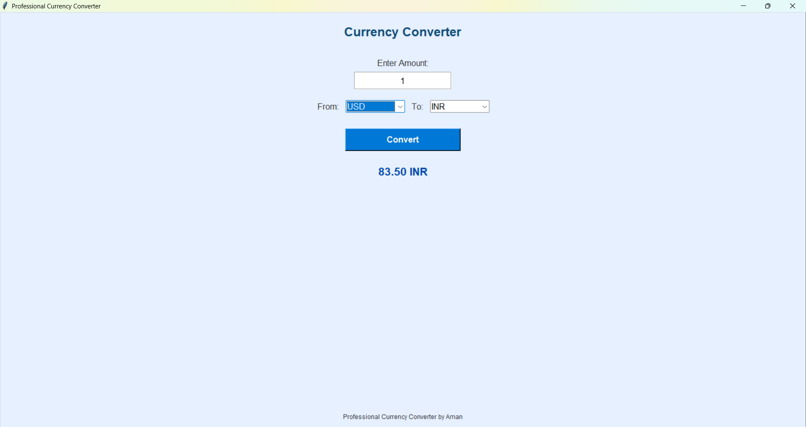

Currency Converter Using Tkinter

A simple and interactive Currency Converter Application built using Python’s Tkinter library.
This project provides a graphical interface that allows users to easily convert an amount from one currency to another.

Features

User-Friendly GUI — Built with Tkinter for smooth interaction.
Real-Time Conversion — Converts currency values instantly.
Dropdown Menus — For selecting “From” and “To” currencies.
Error Handling — Handles invalid inputs gracefully.
Extendable — Can be upgraded to use live exchange rate APIs.

### Screenshots

Technologies Used

Python 3.x
Tkinter – For building the graphical user interface

Project Structure
Currency-Converter/
│
├── currency_converter.py      # Main application file
|__ README.md                  # Project documentation

How to Run the Project

Clone the Repository
git clone https://github.com/amanchougule09/Currency-Converter-using-TKinter.git

Navigate to Project Directory
cd currency-converter-tkinter

Run the Application
python currency_converter.py

How It Works

Enter the amount you want to convert.
Choose the source and target currencies from dropdowns.
Click Convert to get the result.
The converted amount is displayed instantly in the output area.

🌟 Future Enhancements

Integrate real-time currency data using an API like ExchangeRate-API or Open Exchange Rates.
Add dark/light themes for better UI experience.
Include historical conversion tracking.

👨‍💻 Author
Aman Chougule
